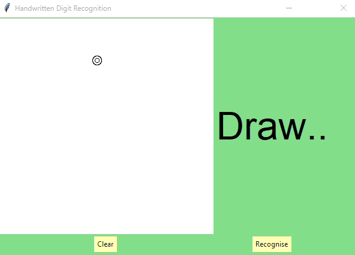
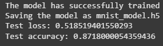

# Handwritten Digits MNIST

Deep Learning Project – Handwritten Digit Recognition in Python

Inspired by the DataFlair Team tutorial (https://data-flair.training/blogs/python-deep-learning-project-handwritten-digit-recognition/), but I had to change a lot because I had issues with base code

## What it does

- Trains a model to recognize handwritten digits using the MNIST dataset
- Lets you draw your own digits in simple tkinter GUI and see what the model thinks it is

## Demo



## Results

The model gets great results on the MNIST test set:



But when you try to draw in the GUI, it sometimes gets confused (especially with 7s and 9s).
Originally it was even worse at predicting drawn digits.

The original MNIST digits were carefully processed by fitting into a 20x20 pixel box, anti-aliasing to grayscale, and then centering in a 28x28 image by moving the center of mass to the center. 

The digits I got from drawing on tkinter canvas were too different to the model input.

So, to help the model, I experimented with Pillow filters to make the user drawings more MNIST-like. 

Still, the model struggles with some digits, especially 7 and 9. This could probably be improved by:
- Rotating, scaling, and distorting training images (data augmentation)
- Adding your own hand-drawn samples from the GUI to the training set

## How to Use

1. Install requirements:
   ```
   pip install -r requirements.txt
   ```
2. Run the training script if you want to retrain the model (I recommend using Google Colab):
   ```
   python training.py
   ```
3. Start the main app:
   ```
   python gui_digits_predict.py
   ```